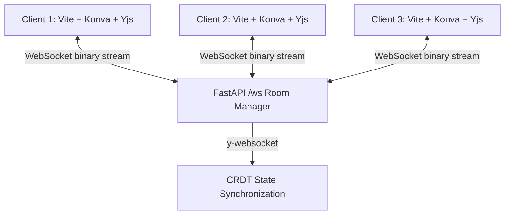

# CollabBoard: Real-Time Collaborative Canvas 🎨

A high-performance, Google-Docs-style collaborative whiteboard built for latency-free concurrent design. This project serves as a technical showcase for handling complex distributed state, conflict resolution, and modern web rendering.


## ⚡ Technical Highlights

- **Conflict-Free Replicated Data Types (CRDTs)**: Utilizes `Yjs` to ensure mathematical convergence of state. Multiple users can edit the exact same object simultaneously without locking or data loss.
- **High-Concurrency Python Signaling**: A `FastAPI` + `WebSockets` backend acts as a rapid relay server for binary CRDT updates.
- **Zero-Latency Rendering (Optimistic UI)**: Built on `Konva.js`, local drawing actions are rendered instantly while asynchronous state sync runs in the background.
- **Live User Awareness**: Implements the Yjs Awareness protocol to broadcast and render live, color-coded cursors of all active participants in real-time.
- **Premium Aesthetics**: Eschews generic frameworks for a custom, glassmorphic CSS Variable-driven interface with micro-animations and typography (`Outfit`).

## 🛠️ Architecture



## 🚀 Getting Started Locally

This project uses a decoupled frontend and backend.

### 1. Start the Signaling Server (Backend)
The backend acts as the room manager and CRDT relay.
```bash
cd server
python3 -m venv venv
source venv/bin/activate
pip install -r requirements.txt  # (fastapi, uvicorn, websockets, ypy-websocket)
uvicorn src.server:app --host 0.0.0.0 --port 3000
```

### 2. Start the Client (Frontend)
The frontend uses Vite for blazing fast HMR.
```bash
cd client
npm install
npm run dev
```
Open `http://localhost:5173` in multiple browser windows to test real-time collaboration!

## 🌍 Production Deployment

### Frontend (Netlify)
The frontend (`/client`) is a static Vite application perfectly suited for Netlify.
1. Connect your GitHub repository to Netlify.
2. Set the Base Directory to `client`.
3. Build command: `npm run build`.
4. Publish directory: `client/dist`.
5. **Environment Variable**: Set `VITE_WS_URL` in Netlify to your deployed backend secure WebSocket URL (e.g., `wss://your-backend.onrender.com`).

### Backend (Render / Railway)
Because Netlify only hosts static files and serverless functions (which don't support persistent WebSockets), the Python backend **cannot** be deployed to Netlify. 
You must deploy the `/server` folder to a service like **Render** or **Railway**:
1. Create a new Web Service on Render.
2. Root directory: `server`.
3. Build command: `pip install -r requirements.txt`.
4. Start command: `uvicorn src.server:app --host 0.0.0.0 --port $PORT`.

## 🤝 How to Record a Showcase
To demonstrate the power of this application for LinkedIn/GitHub:
1. Open two browser windows side-by-side.
2. Ensure both connect to the same room.
3. Rapidly draw shapes in both windows simultaneously to demonstrate the CRDT conflict resolution handling intersecting data streams without jitter.
